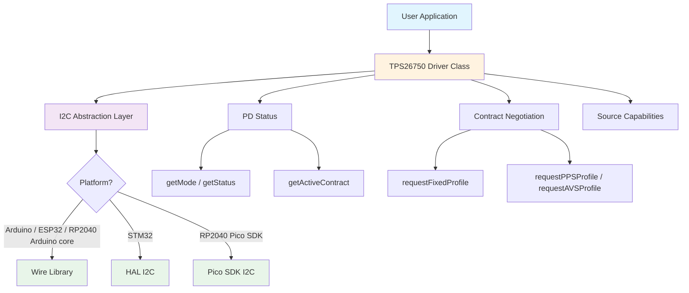

# TPS26750 Multiplatform Library

[](LICENSE.txt)
[](https://github.com/theohg/tps26750_multiplatform/releases)
[](https://github.com/theohg/tps26750_multiplatform/actions)


> ⚡ **Featured in [PD240W](https://github.com/theohg/PD240W)** — an open-source USB-C bench supply that negotiates USB Power Delivery 3.1 EPR into a programmable 240 W (48 V / 5 A) output. This library drives its PD controller.

A C++ library for controlling the **[TPS26750](https://www.ti.com/product/TPS26750)** USB Type-C Power Delivery controller from Texas Instruments via I2C. It supports Arduino, ESP32, STM32, and RP2040 targets and uses a per-instance bus handle so multiple buses or devices can be used without global transport state.

## Features

- **Multi-platform**: Single codebase for Arduino/ESP32 (Wire), STM32 (HAL), and RP2040
- **Bus-first design**: The active I2C bus is passed directly into the constructor
- **Unique Address Interface**: Implements the TPS26750 byte-count framing for register reads and writes
- **PD status**: Read controller mode, Type-C connection/orientation/role, and PD spec revision
- **Contract inspection**: Decode the active Fixed, PPS, or AVS contract voltage and current
- **Source capabilities**: Enumerate SPR (PDO 1-7) and EPR (PDO 8-13) source power profiles
- **Sink negotiation**: Request Fixed, PPS, and AVS profiles via the Auto Negotiate Sink register
- **Port partner info**: Run GPPI / MBRd 4CC tasks to fetch manufacturer information

## Architecture



## Repository Layout

```text
include/
    tps26750.h
    tps26750_platform_config.h
    tps26750_platform_i2c.h
src/
    tps26750.cpp
    tps26750_platform_i2c.cpp
examples/
    pd_status_monitor/
    source_capabilities/
.github/workflows/
    ci.yml
    release.yml
```

## Installation

### PlatformIO

Add to your `platformio.ini`:

```ini
lib_deps =
        https://github.com/theohg/tps26750_multiplatform.git#v1.0.0
```

### Arduino IDE

Download the repository or a release zip, then add it through Sketch -> Include Library -> Add .ZIP Library.

### STM32 HAL / Pico SDK

Copy `include/` and `src/` into your project, make sure the correct HAL or Pico SDK headers are available to the compiler, and keep I2C initialization in your application code.

## Usage Pattern

1. Initialize the I2C peripheral yourself.
2. Pass the active bus handle as constructor argument 1: `&Wire`, `&hi2c1`, `i2c0`, or `i2c1`.
3. Pass the 7-bit device address as constructor argument 2 (default `0x21`).
4. Call `init()` before using the driver.

For Arduino-based Pico builds, use `&Wire`. For pure Pico SDK builds, use `i2c0` or `i2c1` directly.

## Quick Start

### Arduino / ESP32 / RP2040 Arduino core

```cpp
#include <Wire.h>
#include <tps26750.h>

#define TPS26750_ADDR   0x21

TPS26750 pd(&Wire, TPS26750_ADDR);

void setup() {
        Serial.begin(115200);
        Wire.begin();

        if (!pd.init()) {
                Serial.println("TPS26750 not found.");
        }
}

void loop() {
        char mode[5];
        if (pd.getMode(mode)) {
                Serial.print("Mode: ");
                Serial.println(mode);
        }

        uint32_t mv = 0, ma = 0;
        if (pd.getActiveContract(mv, ma)) {
                Serial.print(mv);
                Serial.print(" mV @ ");
                Serial.print(ma);
                Serial.println(" mA");
        }
        delay(2000);
}
```

### STM32 HAL / Pico SDK

```cpp
#include "tps26750.h"

TPS26750 pd(&hi2c1, 0x21);
// For a pure Pico SDK project, pass i2c0 or i2c1 instead of &hi2c1.

void app_init() {
        if (!pd.init()) {
                // handle missing device
        }

        // Request a 9 V fixed contract at up to 3 A.
        pd.requestFixedProfile(9000, 3000);
}
```

## Functional Overview

### Controller Capabilities

| Capability | Description |
|------------|-------------|
| PD status | Read controller mode, Type-C connection state, orientation, and port/data role |
| Contract inspection | Decode the active Fixed/PPS/AVS contract voltage and current |
| Source capabilities | Enumerate SPR and EPR source PDOs offered by the attached supply |
| Sink negotiation | Request Fixed, PPS, or AVS contracts through the Auto Negotiate Sink register |
| Interrupts | Read, inspect, and clear the 11-byte interrupt event register |
| Port partner info | Execute GPPI / MBRd 4CC tasks to read manufacturer information |

## API Overview

### PD Status

| Method | Description |
|--------|-------------|
| `init()` | Probe the device and confirm the protocol by reading MODE |
| `isConnected()` | Check whether the device acknowledges on the bus |
| `getMode(modeStr)` | Read the 4-char controller mode (e.g. `"APP "`, `"BOOT"`) |
| `getStatus(buf)` | Read the 5-byte STATUS register |
| `getPdStatus(buf)` | Read the PD3_STATUS register (negotiated spec revision) |
| `getActiveContract(mv, ma)` | Decode the active contract voltage and current |

### Capabilities and Negotiation

| Method | Description |
|--------|-------------|
| `getSourceCapabilities(caps, max)` | Enumerate source PDOs into a `TPS26750_SourceCapability` array |
| `requestFixedProfile(mv, ma)` | Request a standard fixed-voltage contract |
| `requestPPSProfile(mv, ma, min, max)` | Request a PPS (programmable) contract |
| `requestAVSProfile(mv, ma, min, max)` | Request an AVS (adjustable) contract |

### Commands and Interrupts

| Method | Description |
|--------|-------------|
| `sendCommand("Gaid")` | Send a 4CC command to the CMD1 register |
| `readInterrupts(buf)` | Read the 11-byte interrupt event register |
| `isInterruptSet(buf, bit)` | Test an interrupt bit (0-87) in a buffer |
| `clearInterrupts(mask)` | Clear interrupt events via INT_CLEAR1 |
| `getManufacturerInfo(frame, buf, max, len)` | Fetch port-partner manufacturer info |
| `getLastError()` | Return and clear the last error code |

## Examples

- `examples/pd_status_monitor/pd_status_monitor.ino`
- `examples/source_capabilities/source_capabilities.ino`

## Notes

- Device addresses are always 7-bit. The TPS26750 address (0x20-0x23) is decoded from its ADCINx pins.
- The TPS26750 uses a chip-specific "Unique Address Interface": reads return a leading byte-count and writes prepend a length. This framing lives in the driver; the platform layer exposes only raw transfers.
- Some registers are large (the source-capability register is 53 bytes, DATA1 is 64 bytes). Classic AVR Arduino cores cap the Wire buffer at 32 bytes, so use ESP32, STM32, or RP2040 to read them in full.
- For Arduino-based Pico builds, use `&Wire`; for pure Pico SDK builds, pass `i2c0` or `i2c1`.
- PlatformIO CI compiles the examples on Arduino Nano, ESP32, STM32, and RP2040.

## You Like This Library? See Also

- [BQ25756E Multiplatform](https://github.com/theohg/bq25756e_multiplatform)
- [DRV8214 Multiplatform](https://github.com/theohg/drv8214_multiplatform)
- [INA228 Multiplatform](https://github.com/theohg/ina228_multiplatform)

## License

MIT License. See [LICENSE.txt](LICENSE.txt) for details.

Copyright (c) 2026 Theo Heng
